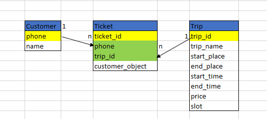

1 người đặt nhiều chuyến đi và 1 chuyến đi có nhiều người.  
=> Customer và Trip là quan hệ n-n(Nhiều nhiều) từ đó ta có vé là trung gian.  
1 người đặt nhiều vé, 1 vé 1 người sở hữu ,1 chuyến đi có nhiều vé, 1 vé chỉ cho 1 chuyến đi.  
=>  Customer và Ticket quan hệ 1-n, Trip và Ticket quan hệ 1-n.  
nên ticket key của customer và trip.  

